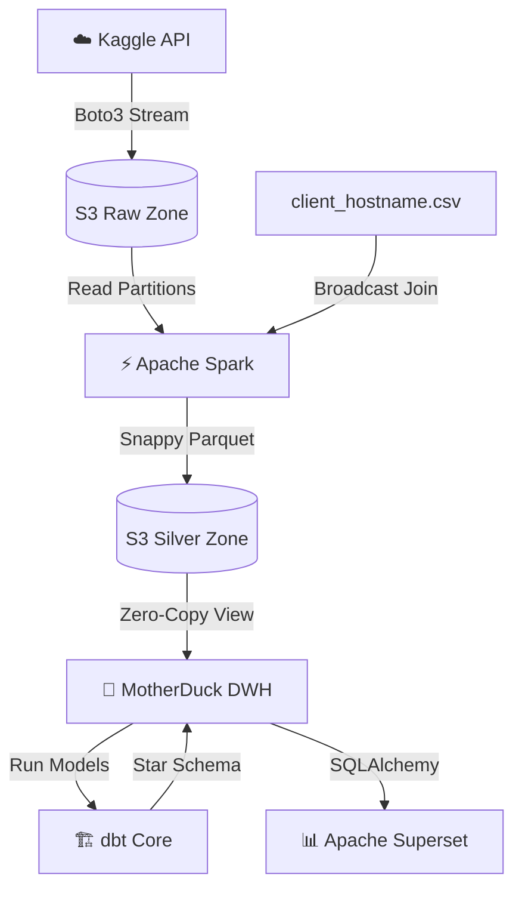

<div align="center">
  
  <h1>🌐 Nginx Log Analysis Lakehouse</h1>
  <p><i>An automated, end-to-end Data Engineering pipeline scaling 3.5GB of web logs using a modern zero-copy cloud Lakehouse architecture.</i></p>
</div>

---

**This is a Graduation Project for the [DataTalks.Club Data Engineering Zoomcamp 2026](https://datatalks.club/blog/data-engineering-zoomcamp.html).**

The goal of this project is to build a production-grade pipeline that extracts, processes, and visualizes massive web server access logs. It is specifically designed to stream data completely through memory with **zero local disk usage** for data files, making it highly cost-effective and scalable.

## 🏗️ Architecture

The pipeline orchestrates a flow from Raw Data to a fully modeled Kimball Star Schema, capped by an interactive BI dashboard.



## 📊 End-to-End Tech Stack

| Phase | Technology | Purpose |
|-------|-----------|---------|
| **Orchestration** | 🌬️ **Apache Airflow 2.9** | Containerized DAG scheduling & failure management |
| **Ingestion** | 🐍 **Python / boto3**   | In-memory data streaming to Cloud |
| **Storage** | 🪣 **AWS S3**          | Data Lake (Raw / Silver Parquet) |
| **Processing** | ⚡ **Apache Spark 3.5** | Fast CSV parsing, enrichment, and deduplication |
| **Data Warehouse**| 🦆 **MotherDuck**     | Serverless OLAP connected directly to S3 |
| **Transformation**| 🏗️ **dbt** (dbt-duckdb) | `staging` → `core` (Kimball) → `dashboard` aggregations |
| **Visualization** | 📊 **Apache Superset**| Real-time interactive dashboards with Dark Theme |

---

## 🚀 Quick Start

### Prerequisites
- Docker Desktop
- AWS account (Access Keys)
- [MotherDuck](https://motherduck.com/) account (Service Token)
- Kaggle account (API Token `kaggle.json`)

### 1. Configure the Environment
```bash
git clone https://github.com/Ibrahim-Ayman/log-analysis.git
cd log-analysis

# Create your .env file
cp .env.example .env
# Open .env and carefully add your API keys
```

### 2. Stand up the Infrastructure
```bash
docker compose up -d
```
*Bootstraps Airflow, Spark Master, Spark Workers, Postgres, and Superset.*

### 3. Initialize the Pipeline
```bash
# 1. Create S3 raw and silver buckets
docker compose exec airflow-webserver python /opt/airflow/scripts/setup_s3.py

# 2. Register datasets and MotherDuck connection in Superset
docker compose exec superset python /app/superset_register.py
```

### 4. Trigger the DAGs (Airflow)
Go to `http://localhost:8080` (admin/admin).
Trigger the DAG **`nginx_ingestion`**. It will automatically cascade:
*   `nginx_ingestion` (Extract/Load to Bronze)
*   `nginx_processing` (Spark Transform to Silver)
*   `nginx_warehouse` (MotherDuck View Setup + dbt Models + Data Quality Tests)

### 5. Access the Dashboard
Go to `http://localhost:8088` (admin/admin). Your datasets are pre-registered! Apply the `nginx_dark_theme.css` and arrange your charts.

---

## 📁 Repository Structure

```text
log-analysis/
├── dags/
│   ├── nginx_ingestion.py      # DAG A: Kaggle → S3
│   ├── nginx_processing.py     # DAG B: Spark Transformations
│   └── nginx_warehouse.py      # DAG C: View Mapping & dbt Execution
├── dbt/logs_analytics/
│   ├── models/
│   │   ├── staging/            # Base views and surrogate key hashing
│   │   ├── core/               # Kimball Dimensional Model (Dim/Fact)
│   │   └── dashboard/          # Pre-aggregated tables for BI
│   └── schema.yml              # Source mapping & Data Quality tests
├── docker/
│   ├── airflow/ Dockerfile     # Custom Airflow + boto3 + dbt
│   ├── spark/ Dockerfile       # Spark + Hadoop-AWS jars
│   └── superset/ Dockerfile    # Superset + duckdb-engine
├── scripts/                    # Registration & Setup utilities
├── spark/
│   └── transform.py            # Ultra-fast PySpark CSV processor
└── superset/                   
    └── dashboards/             # Custom CSS themes
```

---

## 💡 Key Design Decisions

1. **Zero-Local-Disk IO**: The `boto3` stream literally fetches from Kaggle and streams via multipart chunks directly to S3 memory buffers. We bypass the `tmp` storage entirely to survive 3.5GB logs on a free-tier VPS.
2. **Spark BroadCasting**: Hostname enrichment relies on Spark's `broadcast()` join, significantly optimizing execution plans for IP lookups.
3. **MotherDuck Zero-Copy**: The Data Warehouse does not copy data. The `nginx_silver_view` is an `httpfs` mapping directly over the S3 partitioned compressed `.parquet` files.
4. **Strict Dimensional Architecture**: Transformed into a Kimball Star Schema for optimal query aggregation speed.

---

<div align="center">
  <i>Created by Ibrahim Ayman</i>
</div>
