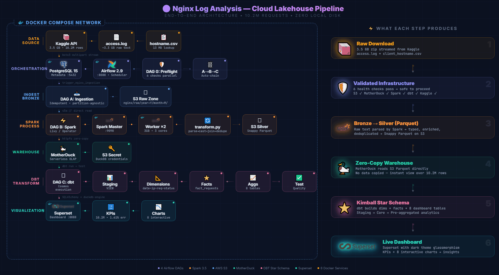
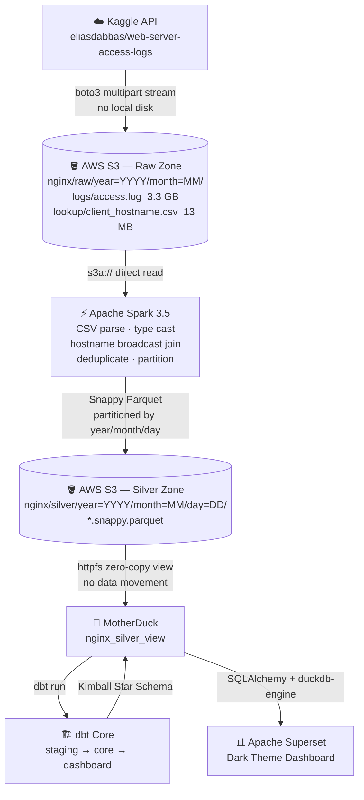
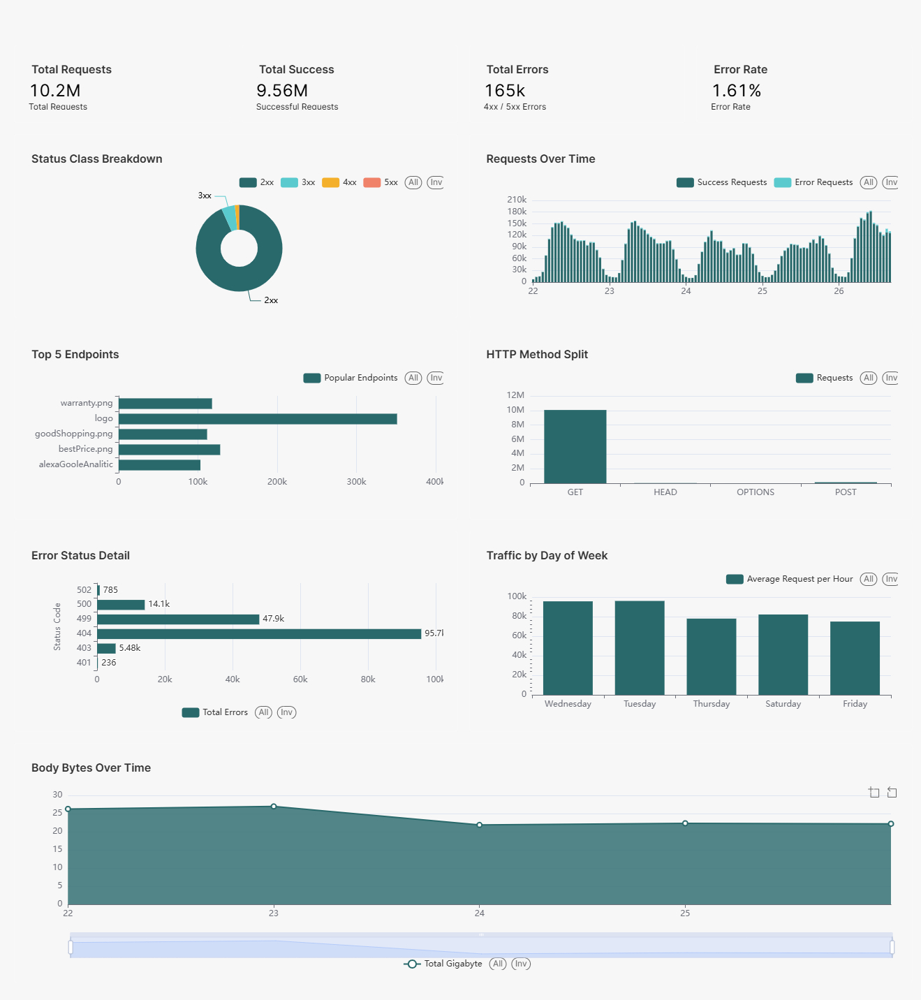

<div align="center">
  
  <h1>🌐 Nginx Log Analysis — Cloud Lakehouse Pipeline</h1>
  <p><i>An automated, end-to-end Data Engineering pipeline that scales 3.5 GB of raw Nginx web logs into a fully modeled, interactive analytics dashboard — with zero local disk usage.</i></p>

  <p>
    
    
    
    
    
    
    
  </p>
  
  <br>
  
</div>

---

## 🎯 Problem Statement & Impact

### The Challenge

Modern web infrastructure generates an unmanageable volume of logs. A single production Nginx server can produce **3–5 GB of access logs per month**, and enterprise environments often generate terabytes. Analyzing this data presents three compounding problems:

| Problem | Real-World Consequence |
|---|---|
| **Volume** | Raw log files exceed the RAM of any single machine, making local processing impossible |
| **Velocity** | New log lines stream continuously; batch jobs must be idempotent and incremental |
| **Variety** | Raw Combined Log Format is unstructured text; it must be parsed, typed, and enriched before it carries any analytical value |

Traditional approaches — `grep`, `awk`, or loading CSVs into a local database — completely break down at this scale. They require downloading the data locally (expensive on disk and bandwidth), can't handle incremental updates cleanly, and offer no path to a shared, collaborative dashboard.

### The Solution

This project builds a **production-grade, cloud-native Lakehouse** that processes the **full 3.5 GB Kaggle Nginx dataset** (`10.2 million requests`) with the following guarantees:

- **Zero local disk usage** — data flows from Kaggle → S3 → MotherDuck entirely through memory buffers and cloud APIs.
- **Full idempotency** — every DAG pre-checks S3 before doing any work. Re-triggering the pipeline never duplicates data.
- **Preflight safety gate** — a dedicated infrastructure health-check DAG validates all connections (S3, MotherDuck, Spark, dbt, Kaggle) before any processing begins.
- **Kimball Star Schema** — raw logs are modeled into dimensions and facts by dbt, enabling fast analytical queries at any aggregation level.

### Who Benefits

| Role | How This Pipeline Helps |
|---|---|
| **DevOps / SRE Teams** | Monitor real-time traffic volume, identify peak load windows (`Traffic by Day of Week`), and catch sudden drops in requests per hour |
| **Security Engineers** | Detect anomalies via `Error Status Detail` — a spike in `404` or `499` errors signals scanning/probing or misconfigured routing |
| **Product & Growth Teams** | Understand the `Top 5 Endpoints` driving the most load to prioritize CDN caching and optimization efforts |
| **Infrastructure Cost Owners** | Trend `Body Bytes Over Time` to forecast bandwidth costs and negotiate CDN contracts |

---

## 🛠 Tech Stack

| Layer | Technology | Version | Role |
|---|---|---|---|
| **Orchestration** | Apache Airflow | 2.9 | DAG scheduling, dependency management, failure alerting |
| **Ingestion** | Python + boto3 | 3.11 | In-memory multipart streaming from Kaggle → S3 |
| **Data Lake** | AWS S3 | — | Immutable Raw (Bronze) and Silver Parquet storage |
| **Processing** | Apache Spark | 3.5 | Distributed CSV parsing, type casting, deduplication, hostname enrichment |
| **Data Warehouse** | MotherDuck / DuckDB | latest | Serverless OLAP engine with zero-copy S3 views |
| **Transformation** | dbt Core (dbt-duckdb) | — | Staging → Kimball Core → Dashboard aggregation layers |
| **Visualization** | Apache Superset | latest | Interactive dashboard with custom dark-theme CSS |
| **Infrastructure** | Docker + Docker Compose | — | Reproducible, one-command environment for all services |

---

## 🏗 Architecture & Workflow

### End-to-End Data Flow


```mermaid
graph TD
    A[☁️ Kaggle API\neliasdabbas/web-server-access-logs] -->|boto3 multipart stream\nno local disk| B[(🪣 AWS S3 — Raw Zone\nnginx/raw/year=YYYY/month=MM/\nlogs/access.log  3.3 GB\nlookup/client_hostname.csv  13 MB)]

    B -->|s3a:// direct read| C[⚡ Apache Spark 3.5\nCSV parse · type cast\nhostname broadcast join\ndeduplicate · partition]

    C -->|Snappy Parquet\npartitioned by year/month/day| D[(🪣 AWS S3 — Silver Zone\nnginx/silver/year=YYYY/month=MM/day=DD/\n*.snappy.parquet)]

    D -->|httpfs zero-copy view\nno data movement| E[🦆 MotherDuck\nnginx_silver_view]

    E -->|dbt run| F[🏗️ dbt Core\nstaging → core → dashboard]

    F -->|Kimball Star Schema| E

    E -->|SQLAlchemy + duckdb-engine| G[📊 Apache Superset\nDark Theme Dashboard]
```

### The Four DAGs

> **Entry point:** Always trigger `pipeline_preflight`. It auto-chains the full pipeline on success.

#### DAG 0 — `pipeline_preflight` *(Infrastructure Health Gate)*

The pipeline's safety guardian. Runs **6 checks in parallel** before any data work begins. If a single check fails, the entire pipeline halts.

```
check_env_vars  ─┐
check_s3        ─┤
check_motherduck─┤──► all_checks_passed ──► trigger_nginx_ingestion
check_spark     ─┤
check_dbt       ─┤
check_kaggle    ─┘
```

| Task | What It Validates |
|---|---|
| `check_env_vars` | All 8 required env vars are present and non-empty |
| `check_s3` | `boto3.head_bucket()` — credentials valid, bucket exists |
| `check_motherduck` | `duckdb.connect("md:?token=...")` + `SELECT 1` |
| `check_spark` | `docker ps --filter name=spark-master` → container is `Up` |
| `check_dbt` | File existence + `dbt parse` — validates Jinja graph |
| `check_kaggle` | `KaggleApi().authenticate()` + dataset metadata call |

---

#### DAG A — `nginx_ingestion` *(Extract & Load to Bronze)*

Streams the Kaggle dataset to S3 with **zero local disk touch**.

```
kaggle_to_s3 ──► trigger_processing
```

**Key logic:**
- **Idempotency (partition-agnostic):** Instead of checking today's `year/month` key (which would always miss old uploads), it paginates the entire `nginx/raw/` prefix with `list_objects_v2` to find `access.log` and `client_hostname.csv` anywhere in the tree. If both exist, it exits immediately — no 3.3 GB re-download.
- **Streaming upload:** Uses `boto3.s3.transfer.TransferConfig` with 8 MB multipart chunks and 4 concurrent threads, keeping peak memory under 100 MB regardless of file size.

---

#### DAG B — `nginx_processing` *(Spark Transform to Silver)*

Submits a PySpark job to the Spark cluster via `docker exec` through the mounted Docker socket.

```
spark_transform ──► verify_silver_zone ──► trigger_warehouse
```

**Key logic:**
- **Silver pre-check:** Calls `list_objects_v2` on `nginx/silver/` (MaxKeys=5) before ever starting Spark. If Parquet files exist, it skips the 10-hour job entirely.
- **Incremental processing:** `transform.py` reads the maximum existing timestamp from Silver before reading Raw, then filters `WHERE timestamp > max_ts`, so only genuinely new records are processed on re-runs.
- **Broadcast join:** `client_hostname.csv` (13 MB) is broadcast to all Spark workers for IP→hostname enrichment, avoiding a full shuffle join.

---

#### DAG C — `nginx_warehouse` *(MotherDuck View + dbt Star Schema)*

Connects to MotherDuck and builds the full analytical layer.

```
setup_motherduck_warehouse
    ──► dbt_run_staging
        ──► dbt_run_dimensions
            ──► dbt_run_facts
                ──► dbt_run_dashboard
                    ──► dbt_test_quality
```

**Key logic:**
- Creates a `DuckDB SECRET` for S3 credentials inside MotherDuck so the cloud engine can directly read your S3 bucket without key exposure in SQL.
- `nginx_silver_view` is a zero-copy view over `s3://bucket/nginx/silver/*/*/*/*.parquet` with `hive_partitioning=1` — MotherDuck automatically discovers `year/month/day` partition columns from the path.
- dbt models are run in dependency order: staging views → dimension/fact tables → pre-aggregated dashboard tables → data quality tests.

---

### Data Lake vs. Data Warehouse

| Layer | Storage | Format | Role |
|---|---|---|---|
| **Bronze (Raw)** | AWS S3 `nginx/raw/` | Raw `.log` + `.csv` text | Immutable source of truth, exactly as downloaded |
| **Silver** | AWS S3 `nginx/silver/` | Snappy-compressed Parquet, partitioned | Cleaned, typed, deduplicated, query-ready |
| **Gold (Warehouse)** | MotherDuck | DuckDB tables + views | Star Schema modeled, aggregated, BI-ready |

---

## 📊 Data Partitioning Strategy

### How Data is Partitioned

The Spark transform job writes Silver Parquet files partitioned by three columns:

```python
df.repartition("year", "month", "day")
  .write
  .mode("append")
  .partitionBy("year", "month", "day")
  .parquet(SILVER_PATH)
```

This produces a directory tree like:
```
nginx/silver/
  year=2019/
    month=1/
      day=22/  ← part-00001-4805244c.c000.snappy.parquet
      day=23/
    month=2/
```

### Why This Matters — Data Pruning

Without partitioning, every query on 3.5 GB of Parquet must scan **all files**. With date partitioning, the query engine (DuckDB/MotherDuck with `hive_partitioning=1`) **reads only the relevant directory**:

```sql
-- Scans ONLY year=2019/month=1/day=22/ — skips all other partitions
SELECT count(*) FROM nginx_silver_view
WHERE year = 2019 AND month = 1 AND day = 22;
```

| Scenario | Files Scanned | Data Read |
|---|---|---|
| Without partitioning | All 100+ Parquet files | ~3.5 GB |
| With `year/month/day` partitioning | 1 directory | ~30 MB |

This translates directly to **lower MotherDuck query costs** (less data scanned = cheaper) and **faster dashboard load times** in Superset.

---

## 🌐 External Integration Guide

### 1. AWS — S3 & IAM

1. **Create an AWS account** at [https://aws.amazon.com/](https://aws.amazon.com/)
2. Navigate to **IAM** → **Users** → **Create user**
3. Attach the following permissions (inline or via policy):
   ```json
   {
     "Effect": "Allow",
     "Action": ["s3:GetObject","s3:PutObject","s3:DeleteObject",
                "s3:ListBucket","s3:CreateBucket","s3:HeadBucket"],
     "Resource": ["arn:aws:s3:::YOUR-BUCKET-NAME",
                  "arn:aws:s3:::YOUR-BUCKET-NAME/*"]
   }
   ```
4. Go to **Security credentials** → **Create access key** → choose *Application outside AWS*
5. Copy `Access Key ID` → `AWS_ACCESS_KEY_ID` in your `.env`
6. Copy `Secret Access Key` → `AWS_SECRET_ACCESS_KEY` in your `.env`

### 2. MotherDuck — Token Setup

1. Sign up at [https://app.motherduck.com/](https://app.motherduck.com/)
2. Click your avatar (top-right) → **Settings** → **Access Tokens**
3. Click **Generate token** — copy the full JWT string
4. Paste into `MOTHERDUCK_TOKEN` in your `.env`
5. Set `MOTHERDUCK_DATABASE=nginx_analytics` (created automatically on first run)

### 3. Kaggle — API Credentials

1. Log in at [https://www.kaggle.com/](https://www.kaggle.com/)
2. Click your profile picture → **Settings** → scroll to **API** section
3. Click **Create New Token** — this downloads `kaggle.json`
4. Open the file and copy:
   - `"username"` value → `KAGGLE_USERNAME` in your `.env`
   - `"key"` value → `KAGGLE_KEY` in your `.env`

> The pipeline uses the dataset: [`eliasdabbas/web-server-access-logs`](https://www.kaggle.com/datasets/eliasdabbas/web-server-access-logs)

---

## ⚙️ Prerequisites & Setup

### Prerequisites

- **Docker Desktop** — [Install here](https://www.docker.com/products/docker-desktop/) (allocate ≥8 GB RAM in Docker settings)
- AWS account with S3 access keys
- MotherDuck account with a personal access token
- Kaggle account with API key

### Environment Variables

Copy the template and fill in your real values:

```bash
cp .env.example .env
```

| Variable | Required | Description |
|---|---|---|
| `AWS_ACCESS_KEY_ID` | ✅ | AWS IAM access key |
| `AWS_SECRET_ACCESS_KEY` | ✅ | AWS IAM secret key |
| `AWS_DEFAULT_REGION` | ✅ | e.g. `us-east-1` |
| `S3_BUCKET_NAME` | ✅ | Must be globally unique, e.g. `my-nginx-logs-2026` |
| `MOTHERDUCK_TOKEN` | ✅ | MotherDuck personal access token (JWT) |
| `MOTHERDUCK_DATABASE` | ✅ | `nginx_analytics` (created automatically) |
| `KAGGLE_USERNAME` | ✅ | Your Kaggle account username |
| `KAGGLE_KEY` | ✅ | Your Kaggle API key |
| `POSTGRES_USER` | ✅ | Airflow metadata DB user (e.g. `airflow`) |
| `POSTGRES_PASSWORD` | ✅ | Airflow metadata DB password |
| `POSTGRES_DB` | ✅ | Airflow metadata DB name (e.g. `airflow`) |
| `AIRFLOW__CORE__FERNET_KEY` | ✅ | Generate: `python -c "from cryptography.fernet import Fernet; print(Fernet.generate_key().decode())"` |
| `AIRFLOW__WEBSERVER__SECRET_KEY` | ✅ | Generate: `python -c "import secrets; print(secrets.token_hex(32))"` |
| `AIRFLOW_ADMIN_USERNAME` | ✅ | Airflow UI login username |
| `AIRFLOW_ADMIN_PASSWORD` | ✅ | Airflow UI login password |
| `SUPERSET_SECRET_KEY` | ✅ | Generate: `python -c "import secrets; print(secrets.token_hex(42))"` |
| `SUPERSET_ADMIN_USERNAME` | ✅ | Superset UI login username |
| `SUPERSET_ADMIN_PASSWORD` | ✅ | Superset UI login password |

### Step-by-Step Installation

```bash
# 1. Clone the repository
git clone https://github.com/Ibrahim-Ayman/log-analysis.git
cd log-analysis

# 2. Configure your environment
cp .env.example .env
# Open .env in your editor and fill in every value

# 3. Build and start all services
#    (Postgres, Airflow Init, Airflow Webserver, Scheduler,
#     Spark Master, 2x Spark Workers, Superset)
docker compose up --build -d

# 4. Wait ~60 seconds for Airflow to finish initializing, then verify
docker compose ps   # all services should show "healthy" or "running"

# 5. Create the S3 bucket and folder prefixes
docker compose exec airflow-webserver python /opt/airflow/scripts/setup_s3.py

# 6. Register the MotherDuck connection in Superset
docker compose exec superset python /app/superset_register.py
```

### Running the Pipeline

Open Airflow at **http://localhost:8080** and log in with your `AIRFLOW_ADMIN_USERNAME` / `AIRFLOW_ADMIN_PASSWORD`.

> All pipeline DAGs are set to `is_paused_upon_creation=False` so they are immediately active. Simply trigger `pipeline_preflight` — the full chain runs automatically.

```
pipeline_preflight          ← trigger this manually
    └── nginx_ingestion     ← auto-triggered (Kaggle → S3 Raw)
        └── nginx_processing ← auto-triggered (Spark → S3 Silver)
            └── nginx_warehouse ← auto-triggered (MotherDuck + dbt)
```

Access Superset at **http://localhost:8088**.

---

### 🎨 Dashboard Customization — Applying the Dark Theme

The custom dark theme makes Superset's charts legible on dark backgrounds and gives the dashboard a premium, production-grade look.

**Step-by-step:**

1. Open Superset at `http://localhost:8088`
2. Navigate to your dashboard
3. Click **⋯ (more options)** → **Edit dashboard**
4. Click the **`</>` (CSS)** button in the top-right toolbar
5. Paste the entire contents of [`Dashboard/nginx_css_used.css`](Dashboard/nginx_css_used.css):

```css
.dashboard-grid {
    max-width: 1400px !important;
    margin-left: auto !important;
    margin-right: auto !important;
    padding-top: 40px !important;
}

/* Big number KPI cards */
.big-number-value,
[class*="big-number-value"],
.superset-chart-big-number-number-container span {
    font-size: 56px !important;
    font-weight: 900 !important;
    color: #ffffff !important;
    text-shadow: 0 0 10px rgba(255, 255, 255, 0.3) !important;
}

/* Chart card glassmorphism */
.dashboard-component-chart-holder {
    background: rgba(255, 255, 255, 0.06) !important;
    border: 1px solid rgba(255, 255, 255, 0.12) !important;
    padding: 18px 20px !important;
}

/* Hover lift effect */
.dashboard-component-chart-holder:hover {
    box-shadow: 0 12px 35px rgba(0, 0, 0, 0.7) !important;
    transform: translateY(-5px);
}
/* ... (see full file for all rules) */
```

6. Click **Save** then **Save dashboard**

> **Tip:** For the full dark background, go to Superset's **Settings** → **Theme** and choose the dark variant, then apply the CSS above for fine-grained overrides.

---

## 🖼 Dashboard Showcase



The dashboard surfaces **10.2 million Nginx requests** across 8 interactive charts:

| KPI / Chart | Value / Insight |
|---|---|
| **Total Requests** | 10.2M total requests processed |
| **Total Success** | 9.56M successful (2xx) responses |
| **Total Errors** | 165K errors (4xx / 5xx combined) |
| **Error Rate** | 1.61% — within healthy SLA thresholds |
| **Status Class Breakdown** | Donut chart: ~94% `2xx`, small slices of `3xx`, `4xx`, `5xx` |
| **Requests Over Time** | Time series showing ~120K–210K daily requests; clear weekly traffic patterns |
| **Top 5 Endpoints** | `logo` dominates at ~400K hits; `warranty.png`, `goodShopping.png`, `bestPrice.png` follow — all static assets, ideal CDN candidates |
| **HTTP Method Split** | `GET` accounts for ~10M requests; `HEAD`, `OPTIONS`, `POST` are negligible |
| **Error Status Detail** | `404` leads at 95.7K; `499` (client closed) at 47.9K; `500` at 14.1K; `502`/`503` at <1K |
| **Traffic by Day of Week** | Consistent ~80–100K avg requests/hour across weekdays; slight Friday dip |
| **Body Bytes Over Time** | Average ~25 GB/day served; declining trend suggests caching improvements |

---

## 📁 Repository Structure

```text
log-analysis/
├── dags/
│   ├── pipeline_preflight.py    # DAG 0: Infrastructure health gate (entry point)
│   ├── nginx_ingestion.py       # DAG A: Kaggle → S3 Raw (idempotent, partition-agnostic)
│   ├── nginx_processing.py      # DAG B: Spark transform → S3 Silver (incremental)
│   └── nginx_warehouse.py       # DAG C: MotherDuck view + dbt Star Schema
│
├── dbt/logs_analytics/
│   ├── models/
│   │   ├── staging/             # Base views, surrogate key hashing
│   │   ├── core/                # Kimball Dims (dim_date, dim_endpoint…) + fact_requests
│   │   └── dashboard/           # Pre-aggregated tables for Superset charts
│   ├── dbt_project.yml          # Project config with S3 pre-hook for all models
│   └── profiles.yml             # MotherDuck connection via env_var()
│
├── docker/
│   ├── airflow/Dockerfile       # Airflow + boto3 + dbt-duckdb + kaggle
│   ├── spark/Dockerfile         # Spark 3.5 + hadoop-aws + aws-java-sdk JARs
│   └── superset/Dockerfile      # Superset + duckdb-engine + superset-init.sh
│
├── spark/
│   └── transform.py             # PySpark: CSV parse → type cast → enrich → dedupe → Parquet
│
├── scripts/
│   ├── setup_s3.py              # Create S3 bucket + prefixes
│   ├── setup_motherduck.py      # Init MotherDuck DB + nginx_silver view
│   └── superset_register.py     # Register MotherDuck DB connection in Superset
│
├── Dashboard/
│   ├── Dashboard.jpg            # Final dashboard screenshot
│   └── nginx_css_used.css       # Dark theme CSS for Superset
│
├── docker-compose.yml           # All 8 services with healthchecks + dependency ordering
├── .env.example                 # Template — copy to .env and fill in values
└── README.md
```

---

## 💡 Key Design Decisions

| Decision | Rationale |
|---|---|
| **Zero local disk IO** | `boto3` streams Kaggle → S3 via multipart buffers. No `/tmp` files — the pipeline runs on a 2 GB RAM free-tier VPS |
| **Partition-agnostic idempotency** | Checking `nginx/raw/year=2026/month=05/` would miss data uploaded in April. Instead, we paginate the full prefix and match by filename |
| **Spark broadcast join** | `client_hostname.csv` at 13 MB fits in memory on every worker. Broadcasting eliminates a full shuffle join across 10M rows |
| **MotherDuck zero-copy view** | `nginx_silver_view` is a `httpfs` mapping over S3 Parquet — no ETL into the warehouse, no storage duplication |
| **Preflight gate DAG** | All infra connections are validated before a single byte of data moves. This catches misconfigured `.env` files, expired tokens, and stopped containers before wasting compute |
| **`is_paused_upon_creation=False`** | Airflow 2.x pauses all new DAGs by default. Without this flag, `TriggerDagRunOperator` queues runs that never execute |

---

## 🔄 Reproducibility Guarantee

This project is designed so that any engineer can clone and run it on a fresh machine:

```bash
git clone https://github.com/Ibrahim-Ayman/log-analysis.git
cd log-analysis
cp .env.example .env   # fill in your credentials
docker compose up --build -d
# → Trigger pipeline_preflight in Airflow UI
# → Full pipeline runs automatically
```

No manual database setup. No pre-installed Python packages. No OS-specific configuration. Everything runs inside Docker.

---

<div align="center">
  <p>Built for the <a href="https://datatalks.club/blog/data-engineering-zoomcamp.html">DataTalks.Club Data Engineering Zoomcamp 2026</a></p>
  <i>Created by Ibrahim Ayman</i>
  <br>
  <p>
    <b>Connect with me:</b><br>
    <a href="https://www.linkedin.com/in/ibrahimayman10/"></a>
    <a href="https://x.com/hema_aymen55"></a>
    <a href="mailto:ebrahimaymenzaki55@gmail.com"></a>
  </p>
  <p><i>📞 Phone: +20-109-366-4870</i></p>
</div>
